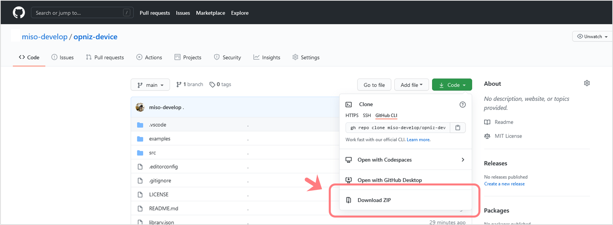
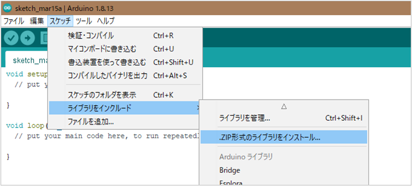

# opniz Arduino Library

`❗ このプロジェクトは現在アルファ版です。`

opnizとはM5StackといったESP32デバイスをNode.jsからobnizライクに制御するための、**Node.js SDK**および**Arduinoライブラリ**です。  
ざっくりいうとサーバーを介さない、オープンソースな、obnizっぽい実装ができるなにかです。  

しくみとしてはESP32デバイスおよびNode.js SDKにて**TCPサーバー/クライアントを実行**し、相互にTCP経由で**JSONメッセージ**をやりとりしています。  


現在Node.js SDK、Arduinoライブラリともに**ESP32**および**M5ATOM**クラスを実装しています。  
M5ATOMクラスで**M5Stack、M5StickC、M5ATOM Lite、M5ATOM Matrixでの動作を確認しています。**  

新たなデバイスクラスを簡単に拡張できる設計となっています。  
おってリファレンスも作成予定ですが、クラス拡張ハンズオンも作成予定です。  


## Arduinoライブラリ

本リポジトリはArduinoライブラリのリポジトリとなります。  
Node.js SDKからのTCPリクエストを処理するハンドラーと、ESP32デバイスからのイベントを発火するエミッターを実装したデバイスクラスを提供します。  
Arduino IDEおよびPlatformIOに対応しています。  


## インストール方法

Arduinoライブラリマネージャーにはまだリリースしていないため、GitHubリポジトリよりZIPをダウンロードのうえ、Arduino IDEにて「.ZIP形式のライブラリをインストール...」を選択しダウンロードしたZIPをライブラリへ追加してください。

また`ArduinoJson`ライブラリのインストールもあわせて行ってください。  
M5系デバイスならそれぞれ対応するライブラリ（M5ATOMなら`M5ATom`と`FastLED`）もインストールしてください。  

### GitHubリポジトリからのZIPダウンロード

「Code」ボタンを押すと表示されるメニューより「Download ZIP」を選択しダウンロードします。  



### Arduino IDEでの.ZIP形式ライブラリのインストール

Arduinoのメニューより「スケッチ」→「ライブラリをインクルード」→「.ZIP形式のライブラリをインストール...」と選択し、ダウンロードしたZIPを選択します。  



### 依存ライブラリのインストール

`ArduinoJson`ライブラリのインストールが別途必要となります。  
またM5ATOMを使用する場合は別途`M5Atom`、`FastLED`のインストールも行ってください。  
（M5Stack、M5StickCも`M5Atom`で動作します）  


## 使い方

以下のコードはM5ATOMクラスを使用した最小限のコードです。  
Arduino IDEメニューの「スケッチ例」→「opniz」→「Basic」にあるコードと同等です。  
（M5Stack、M5StickCも以下のコードで動作を確認しています）  

opnizインスタンスの生成、Wi-Fi接続、Node.js SDK実行端末への接続、そして`loop`関数内でNode.js SDK実行端末からのTCPメッセージの待ち受け・ハンドリングと、デバイスで実装されているイベントの発火を行っています。  

M5ATOMのLED制御やボタンイベントは`Opniz::M5Atom`クラスで実装されているので、このコードをデバイスへ書き込むだけでNode.js SDKから制御可能となります。  
`ssid`、`password`をお使いのWi-Fiのものに、`address`、`port`をそれぞれNode.js SDKを実行している端末のものに書き換え、デバイスに書き込んでみてください。  

```cpp
#include <Opniz.h>
#include <lib/WiFiConnector.h>

const char* ssid = "<SSID>";         // WiFiのSSIDに書き換え
const char* password = "<PASSWORD>"; // WiFiのパスワードに書き換え
WiFiConnector wifi(ssid, password);

const char* address = "192.168.0.1"; // Node.js SDKを実行する端末のIPアドレスを指定
const uint16_t port = 3000;        // 任意のポート番号を指定（opniz Node.js SDKでの指定と合わせる）
Opniz::M5Atom* opniz = new Opniz::M5Atom(address, port); // opnizインスタンス生成

void setup() {
    M5.begin(true, false, true); // M5初期化
    M5.dis.setBrightness(10);    // M5ATOM推奨設定
    setCpuFrequencyMhz(160);     // M5ATOM推奨設定
    
    wifi.connect();   // WiFi接続
    
    opniz->connect(); // Node.js SDK実行端末へ接続
}

void loop() {
    opniz->handleMessage(); // Node.js SDK実行端末からのTCPメッセージを待ち受け/ハンドリング
    opniz->emitMessage();   // デバイスで実装されているイベントを発火
}
```

もちろん実装を追加して独自に拡張することも可能です。  
ハンドラーやエミッターの追加は[`examples/AddHandler/AddHandler.ino`](./examples/AddHandler/AddHandler.ino)が参考になると思います。  

## ライセンス

[MIT](./LICENSE)
